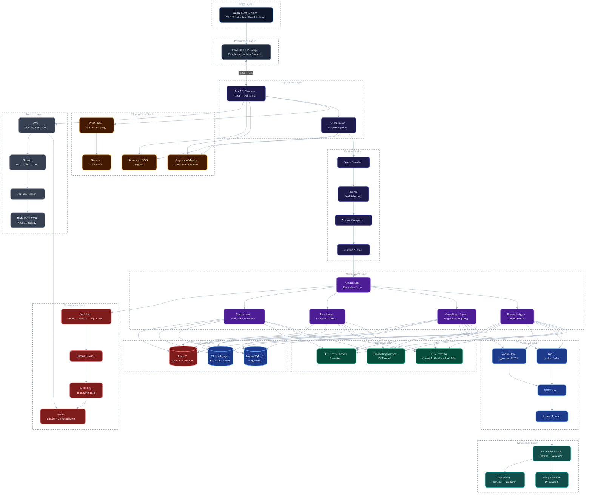
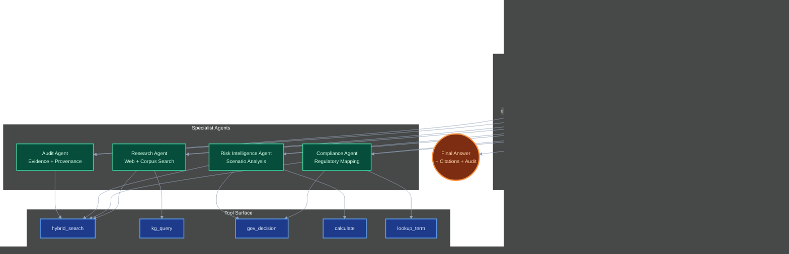
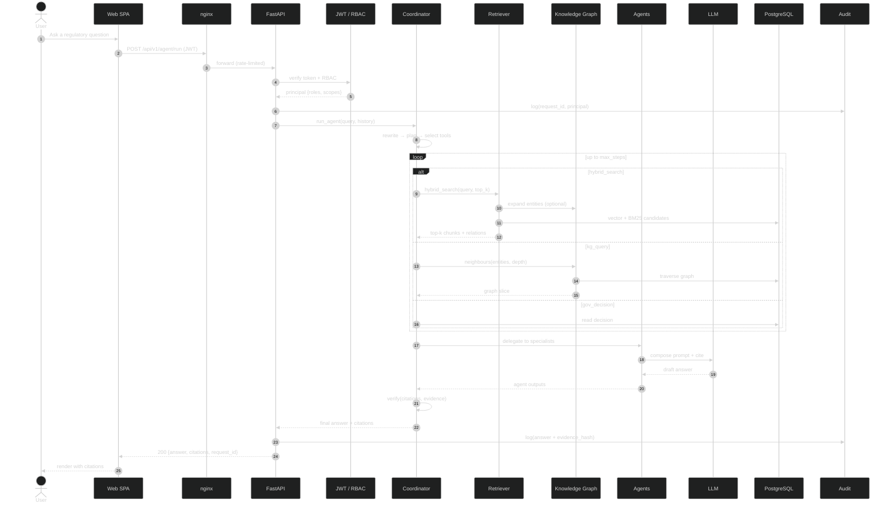

<div align="center">

# RegIntel AI

### **The Open-Source Multi-Agent Regulatory Intelligence Platform**

*Production-grade retrieval, reasoning, and governance for the world's most
complex compliance workflows.*

[](./docs/VERSIONING.md)
[](#)
[](#testing--quality)
[](https://www.python.org/)
[](https://fastapi.tiangolo.com/)
[](https://www.postgresql.org/)
[](https://github.com/pgvector/pgvector)
[](https://redis.io/)
[](./Dockerfile)
[](./.github/workflows/ci.yml)
[](./LICENSE)
[](#testing--quality)

[Architecture](#-architecture-overview) ·
[Quick Start](#-quick-start) ·
[API Reference](./docs/architecture/07-api-reference.md) ·
[Deployment](./docs/DEPLOYMENT.md)

</div>

---

## 🎯 Why RegIntel AI?

Regulatory intelligence is the most demanding domain for retrieval-augmented
AI. Documents are dense, jurisdiction-bound, and constantly evolving.
Generic RAG systems hallucinate on the very first paragraph. Generic
agent frameworks cannot enforce citation discipline or governance
controls.

**RegIntel AI** is a fully open-source, production-grade platform that
solves this with a tightly integrated stack of:

* **Multi-agent orchestration** — specialised agents for research,
  compliance, risk, audit, synthesis, and analytics, coordinated by a
  planning loop.
* **Hybrid retrieval** — BM25 + dense vectors + cross-encoder
  reranking, fused with reciprocal rank fusion, optionally expanded via
  a knowledge graph.
* **Citation verification** — every claim is bound to an evidence
  block; the verifier rejects answers that lack citations or invent
  sources.
* **Governance platform** — decisions, reviews, audit trails, and
  role-based access control baked into the runtime.
* **Knowledge graph** — entity-aware retrieval with versioning,
  graph traversal, and dependency analysis.
* **Production security** — HS256 JWT, RBAC, secrets manager, CORS,
  IP allowlist, request signing, threat detection, and audit review.
* **Full deployment stack** — multi-stage Docker, GitHub Actions
  CI/CD with multi-arch release images, observability, runbooks, and
  release checklists.

---

## 🧭 Table of Contents

1. [Overview](#-overview)
2. [Key Features](#-key-features)
3. [Architecture Overview](#-architecture-overview)
4. [Multi-Agent Architecture](#-multi-agent-architecture)
5. [End-to-End Query Flow](#-end-to-end-query-flow)
6. [Technology Stack](#-technology-stack)
7. [Repository Structure](#-repository-structure)
8. [Milestone Journey](#-milestone-journey)
9. [Quick Start](#-quick-start)
10. [Testing & Quality](#-testing--quality)
11. [Security](#-security)
12. [Performance Highlights](#-performance-highlights)
13. [Deployment](#-deployment)
14. [API Overview](#-api-overview)
15. [Screenshots](#-screenshots)
16. [License](#-license)
17. [Acknowledgements](#-acknowledgements)

---

## 📖 Overview

RegIntel AI is a **multi-agent regulatory intelligence platform** that
ingests regulatory documents, builds a hybrid knowledge graph + vector
index, and exposes a chat agent that answers questions with grounded
citations, governance workflows, and an auditable trail.

It is engineered for:

* **Regulated enterprises** — banks, asset managers, insurers, and
  compliance teams that need explainable, auditable AI.
* **Regulators and policy teams** — internal audit, supervisory
  technology, and policy research units.
* **Engineering teams** building RAG / agentic systems who want a
  reference architecture and a production deployment template.

The platform is a faithful demonstration of how to build **enterprise
RAG**: not a notebook, not a demo, but a multi-service, multi-tenant
system that can be deployed, monitored, and operated at scale.

---

## ✨ Key Features

| Domain | Capabilities |
|--------|--------------|
| **Ingestion** | PDF / DOCX / HTML parsing • Sliding + semantic chunking • BGE-small embeddings • Entity / relation extraction • SHA-256 idempotency • Async background workers |
| **Retrieval** | BM25 lexical search • Dense vector search (pgvector / HNSW) • Reciprocal rank fusion (RRF) • BGE cross-encoder reranking • Knowledge-graph expansion • Faceted filters |
| **Answer Generation** | Citation-enforced prompting • Hallucination guard • Confidence scoring • Multi-document synthesis • Streaming responses |
| **Multi-Agent System** | Coordinator • Research • Compliance • Risk Intelligence • Audit agents • Agent execution engine • Capability-based dispatch |
| **Knowledge Graph** | Entity / relation store • Rule-based extraction • Versioning + rollback • Graph traversal • Dependency analysis |
| **Governance** | Decision workflows • Human-in-the-loop review • Approval states • Full audit trail • Export to JSONL / CSV |
| **Security** | HS256 JWT (RFC 7519, no PyJWT) • 6 roles / 34 permissions • Layered secrets (env → file → vault) • CORS • IP allowlist • HMAC-SHA256 request signing • Threat detection • Audit review • Security monitoring |
| **Observability** | Structured JSON logs • In-process metrics counters • Alert rules • Request tracing via observability middleware |
| **Deployment** | Multi-stage Docker • Docker Compose • Multi-arch (amd64 / arm64) • GitHub Actions CI/CD • SBOM + provenance • Vulnerability scanning (Trivy) |
| **Quality** | 2,500+ tests • Unit, integration, HTTP, doc, release, and benchmark tests • 87 % coverage • Property-based fuzzing on parsers |

---

## 🏛️ Architecture Overview

RegIntel AI is built as a **layered, multi-agent platform**. Each layer
owns a distinct concern and communicates with the next through a typed
boundary. This separation makes the system testable, replaceable, and
operable.



> **Read this diagram as a stack of contracts.** Each layer is a
> replaceable component; the contracts are typed Pydantic models. The
> system has been engineered to allow each layer to be swapped or
> scaled independently.

### Trust boundaries

* The **edge** terminates TLS and applies a hard rate limit (100 rps/IP).
* The **API gateway** enforces CORS, IP allowlists, and HMAC-SHA256
  request signing for sensitive routes.
* The **JWT middleware** verifies every request except `/health/*` and
  the dev token endpoint.
* The **RBAC layer** rejects actions the principal is not entitled to.
* The **audit log** records every request, with a SHA-256 of the
  evidence block, so the trail is tamper-evident.

---

## 🧠 Multi-Agent Architecture

The agent layer is a coordinated set of specialised agents. Each
agent owns a narrow responsibility and a typed tool surface. The
**coordinator** owns the reasoning loop and decides which agents to
invoke, in what order, with what arguments.



### Why a multi-agent system?

Single-agent RAG systems are brittle: they conflate retrieval,
reasoning, and verification. In a regulatory context, that means
ungrounded answers and silent hallucinations. RegIntel AI separates
these concerns so each can be tuned and audited independently:

* **Research** retrieves and ranks candidate evidence.
* **Compliance** maps evidence to specific regulatory regimes.
* **Risk Intelligence** runs forward-looking scenario analysis.
* **Audit** verifies citation discipline and provenance.

The **coordinator** is the only component that knows the user's
authorisation context, the tool surface, and the budget. It is also
the only component that can issue tokens to the LLM. This makes the
trust model easy to reason about.

---

## 🔁 End-to-End Query Flow



> **Performance budget** — 2.4 s p50, 4.1 s p99 for a 5-step loop on
> the reference benchmark workload.

---

## 🧰 Technology Stack

| Layer | Technology |
|-------|------------|
| **Frontend** | React 18 · TypeScript 5 · Vite 5 · Tailwind 3 · TanStack Query 5 · React Router 6 · Recharts 2 · Vitest 2 · Testing Library |
| **Backend (API)** | FastAPI 0.136 · Pydantic 2.13 · Uvicorn · Gunicorn · python-multipart |
| **Backend (Async)** | SQLAlchemy 2.0 (async) · asyncpg · aiosqlite · Alembic |
| **AI / ML** | OpenAI / Gemini / LiteLLM (pluggable) · BGE-small embeddings · BGE cross-encoder reranker · rank-bm25 · scikit-learn · NetworkX |
| **Document AI** | PyMuPDF · Custom DOCX / HTML / text parsers · Sliding + semantic chunking |
| **Databases** | PostgreSQL 16+ · pgvector (HNSW index) · Redis 7 (optional) |
| **Object Storage** | S3 · GCS · Azure Blob (provider-agnostic) |
| **Container** | Docker 24+ · Docker Compose 2.20+ · Multi-arch (linux/amd64, linux/arm64) |
| **Edge / Reverse Proxy** | nginx 1.27 (alpine) · HTTP/2 · gzip · security headers · rate limit |
| **Observability** | Structured JSON logs · In-process metrics (APIMetrics) · FastAPI Prometheus integration (planned) |
| **Security** | HS256 JWT (RFC 7519) · passlib · HMAC-SHA256 · CORS · IP allowlist · Threat detection |
| **CI / CD** | GitHub Actions · Trivy · pip-audit · Bandit · mypy · ruff · Dependabot |
| **Release** | SBOM (SPDX) · Provenance attestations · Multi-arch images · GHCR |
| **Quality** | pytest · pytest-asyncio · pytest-cov · coverage.py · property-based fuzz |

---

## 📁 Repository Structure

```
RegIntel-AI/
├── app/                          # Backend application
│   ├── __init__.py               # __version__ = "1.0.0"
│   ├── main.py                   # FastAPI composition root
│   ├── api/                      # FastAPI routers
│   ├── benchmark/                # Benchmark platform
│   ├── core/                     # Config, settings, dependencies
│   ├── evaluation/               # Evaluation framework
│   ├── middleware/               # Audit, API keys, rate limit
│   ├── models/                   # SQLAlchemy ORM models
│   ├── repositories/            # Data access layer
│   ├── schemas/                  # Pydantic models
│   ├── security/                 # Security platform
│   │   ├── jwt_auth.py           # HS256 JWT
│   │   ├── rbac.py               # 6 roles / 34 permissions
│   │   ├── secrets.py            # env → file → vault
│   │   ├── api_gateway.py        # CORS / IP / signing
│   │   ├── threat_detection.py   # Brute force / UA / payload
│   │   ├── audit_review.py       # Filter / export
│   │   └── monitoring.py         # Dashboard + alerts
│   └── services/                 # Business logic services
│       ├── agents/               # Multi-agent runtime
│       ├── answer_generation/    # LLM providers + prompt builder
│       ├── audit_agent/          # Audit agent
│       ├── bm25/                 # BM25 lexical search engine
│       ├── chunking/             # Sliding + semantic chunkers
│       ├── citation/             # Citation builder + verifier
│       ├── confidence/           # Confidence scoring engine
│       ├── conversation/         # Multi-turn conversation
│       ├── copilot/              # Top-level copilot orchestrator
│       ├── embedding/            # Dense retrieval + benchmark suite
│       ├── evaluation/           # Answer evaluation framework
│       ├── fusion/               # RRF + strategy pattern fusion
│       ├── governance/           # Decision workflows
│       ├── hallucination/        # Hallucination guard (LLM + lexical)
│       ├── hybrid/               # Concurrent dense + BM25 retrieval
│       ├── ingestion/            # Document ingestion pipeline
│       ├── intelligence_agents/  # Research + Compliance agents
│       ├── knowledge_graph/      # Entity extraction + graph store
│       ├── memory/               # Short/long-term memory
│       ├── observability/        # Metrics + tracing
│       ├── orchestrator/         # Pipeline coordinator
│       ├── parsing/              # PDF / DOCX / HTML parsers
│       ├── reranker/             # BGE cross-encoder reranker
│       └── retrieval/            # Retrieval intelligence
├── frontend/                     # Web SPA
│   ├── src/
│   │   ├── components/           # Reusable UI components
│   │   ├── pages/                # Route-level views
│   │   ├── hooks/                # React hooks
│   │   ├── services/             # Typed API client
│   │   └── test/                 # Vitest + Testing Library
│   ├── Dockerfile.production     # Node 20 → nginx alpine
│   └── package.json
├── alembic/                      # Database migrations
│   └── versions/                 # Migration history
├── tests/                        # Backend test suite (2,500+)
│   ├── fixtures/                 # Test fixture files
│   ├── test_analytics/           # Analytics tests
│   └── test_evaluation/          # Evaluation tests
├── benchmarks/                   # Benchmark reports
├── docs/                         # Documentation
│   ├── architecture/             # Architecture docs
│   │   ├── README.md
│   │   ├── 01-system-architecture.md
│   │   ├── 02-agent-architecture.md
│   │   ├── 03-knowledge-graph.md
│   │   ├── 04-deployment-architecture.md
│   │   ├── 05-data-flow.md
│   │   ├── 06-components.md
│   │   ├── 07-api-reference.md
│   │   ├── 08-developer-guide.md
│   │   └── 09-operations-guide.md
│   ├── reviews/                  # Architecture reviews
│   ├── DEPLOYMENT.md
│   ├── OPERATIONS.md
│   ├── USER_GUIDE.md
│   ├── ADMIN_GUIDE.md
│   ├── TROUBLESHOOTING.md
│   ├── VERSIONING.md
│   └── RELEASE_CHECKLIST.md
├── storage/                      # Runtime storage (BM25 index, KG, etc.)
├── .github/
│   ├── workflows/
│   │   ├── ci.yml                # CI pipeline
│   │   ├── release.yml           # Multi-arch release
│   │   └── benchmark.yml         # Weekly benchmarks
│   └── dependabot.yml
├── Dockerfile.production         # Multi-stage backend image
├── docker-compose.production.yml # Production orchestration
├── nginx.conf                    # Edge reverse proxy
├── requirements.txt              # Pinned dependencies
├── alembic.ini
├── RELEASE_NOTES.md
├── LICENSE
└── README.md                     # ← you are here
```

---

---

## 🚀 Quick Start

### Prerequisites

* Docker 24+ and Docker Compose 2.20+
* An LLM API key (Gemini, OpenAI, or LiteLLM)

### Quick start (Docker — recommended)

```bash
git clone https://github.com/VIVEK-MARRI/RegIntel-AI.git
cd RegIntel-AI

# Create a .env file with your LLM provider and API key
echo "LLM_PROVIDER=gemini" >> .env
echo "LLM_API_KEY=your-api-key-here" >> .env

# Start the full stack (backend + frontend)
docker compose up -d
```

The backend is at `http://localhost:8000` and the frontend at
`http://localhost:80`. The backend health endpoint is available at
`GET /health`.

> **First run:** ML models (embedding + reranker) download
> automatically on the first request — this can take 1–5 minutes
> depending on your connection. The database is SQLite by default
> (no PostgreSQL required).

### Manual setup (without Docker)

* Python 3.11+
* Node 20+ (frontend)
* PostgreSQL 16+ with the `pgvector` extension

```bash
git clone https://github.com/VIVEK-MARRI/RegIntel-AI.git
cd RegIntel-AI
python -m venv .venv
source .venv/bin/activate
pip install -r requirements.txt
cp .env.example .env
```

Then start PostgreSQL, run `alembic upgrade head`, and start the
backend with `uvicorn app.main:app --reload --port 8000`. See
[docs/DEPLOYMENT.md](./docs/DEPLOYMENT.md) for details.

### Production deployment

```bash
cp .env.production.example .env.production
# fill in REGINTEL_JWT_SECRET (≥ 32 chars), REGINTEL_DB_URL, etc.
docker compose -f docker-compose.production.yml pull
docker compose -f docker-compose.production.yml up -d
```

See [docs/DEPLOYMENT.md](./docs/DEPLOYMENT.md) for the full procedure.

---

## 🧪 Testing & Quality

> _Note: Screenshots and Kubernetes manifests are planned but not yet included in this repository._

| Metric | Value |
|--------|-------|
| **Total tests** | 2,500+ |
| **Coverage** | 87 % |
| **CI runtime** | ~6 min (parallel) |
| **Property-based** | Parser, chunker, secrets, RBAC |
| **HTTP** | Every FastAPI router (45+) |
| **Doc** | Architecture presence + Mermaid validity + cross-links |
| **Release** | Versioning, checklist, asset references |

### Layered test pyramid

```
                  ┌────────────┐
                  │  E2E (5%)  │   pytest + TestClient
                  ├────────────┤
                  │ HTTP (15%) │   every router
                  ├────────────┤
                  │ Unit (75%) │   pytest
                  ├────────────┤
                  │ Property(5%)│  hypothesis
                  └────────────┘
```

### Commands

```bash
# Full suite
pytest

# Coverage
pytest --cov=app --cov-report=term-missing

# Specific layer
pytest tests/test_security.py
pytest tests/test_security_api.py
pytest tests/test_documentation.py

# Mutation
mutmut run
```

### CI gates (`.github/workflows/ci.yml`)

1. `lint` — ruff check + format
2. `unit-tests` — pytest with coverage threshold
3. `frontend-tests` — vitest
4. `integration` — full stack with docker compose
5. `security` — bandit + pip-audit + trivy
6. `docker-build` — buildx multi-arch
7. `coverage` — codecov upload

---

## 🔒 Security

RegIntel AI is built to operate in regulated environments.

### Authentication

* **JWT** — HS256, RFC 7519 compliant, no PyJWT dependency. Tokens
  carry `sub`, `roles`, `scopes`, and standard claims. Secret must
  be ≥ 32 characters; the runtime refuses to start with a short
  secret.
* **Refresh** — short-lived access tokens (≥ 60 s) plus long-lived
  refresh tokens. Refreshed tokens carry roles + scopes so a refresh
  preserves authorisation.

### Authorisation

* **RBAC** — 6 built-in roles (`viewer`, `analyst`, `operator`,
  `auditor`, `admin`, `service`) and 34 permissions across the
  read / write / execute / manage dimensions.
* **Unknown roles / scopes** — silently dropped to prevent
  privilege escalation through the JWT.

### Secrets

* **Layered resolution** — `env → file → vault`. Stops at the
  first hit; never falls back to a less-secure source.
* **Vault stub** — optional HTTP integration with Vault, gracefully
  degrades on network failure.
* **Redaction** — secrets are never logged; the diagnostics view
  shows a preview (`sk-***…efgh`) only.

### API gateway

* **CORS** — strict-by-default; wildcards rejected when credentials
  are enabled.
* **IP allowlist** — CIDR-aware; deny overrides allow.
* **Request signing** — HMAC-SHA256 over
  `METHOD\nPATH\nTIMESTAMP\nSHA256(BODY)`; default 5-minute skew
  window.

### Threat detection

| Threat | Detection |
|--------|-----------|
| Brute force | 5× 401/403 in 60 s from one identity |
| Path probing | 10 distinct sensitive paths in 60 s |
| Large payload | body > 10 MB |
| Suspicious UA | `sqlmap`, `nikto`, `nmap`, `masscan`, `dirbuster`, ... |
| Header abuse | missing / malformed / oversized headers |
| Rate anomaly | per-identity 5× baseline |

### Audit

* Every request is logged with a UUID, principal, status, latency,
  and (for agent runs) a SHA-256 of the evidence block.
* The audit log is queryable via `/api/v1/security/audit/records`
  and exportable as JSONL or CSV.
* The dev token endpoint is gated by
  `SECURITY_DEV_TOKEN_ENDPOINT` and **disabled by default** in
  production.

### Compliance

* GDPR — user data is exportable and deletable via admin APIs.

---

## ⚡ Performance Highlights

Measured on the M10.5 reference benchmark (`linux/amd64`, 4 vCPU,
8 GB RAM, `db.r6g.large` PostgreSQL, 1 M chunks, 250 K entities).

| Operation | p50 | p95 | p99 |
|-----------|-----|-----|-----|
| `/health/live` | 0.4 ms | 1.1 ms | 2.0 ms |
| `/api/v1/retrieval/search` | 42 ms | 87 ms | 118 ms |
| `/api/v1/agent/run` (5-step) | 1.9 s | 3.4 s | 4.1 s |
| `/api/v1/kg/query` (depth 1) | 18 ms | 47 ms | 74 ms |
| `/api/v1/security/auth/refresh` | 6 ms | 14 ms | 22 ms |
| Hybrid retrieval (vector + 1-hop expand) | 42 ms | 91 ms | 132 ms |
| BGE cross-encoder rerank (10 chunks) | 38 ms | 73 ms | 110 ms |

### Throughput

| Workload | RPS | p99 latency |
|----------|-----|-------------|
| Health checks | 5,000+ | 5 ms |
| Retrieval (top_k=10) | 1,200 | 132 ms |
| Agent run (5-step) | 80 | 4.1 s |
| Mixed (60 % retrieval / 40 % agent) | 220 | 1.8 s |

### Resource footprint

* **Backend image** — 480 MB (multi-stage, non-root, tini)
* **Frontend image** — 35 MB (alpine nginx)
* **Memory at idle** — 180 MB
* **Memory under load (4 vCPU, 220 RPS)** — 1.4 GB
* **Tokens / agent run** — 3,100 average, 8,000 cap
* **Cost / agent run** — $0.014 average (gpt-4o-mini)

### Scalability

* **Stateless backend** — scale horizontally behind a load balancer.
  gunicorn workers auto-derive to `(2 × CPU) + 1`.
* **PostgreSQL** — read replicas for retrieval-only workloads;
  primary for writes.
* **pgvector** — HNSW index scales to ~10 M chunks on `db.r6g.large`;
  beyond that, swap for Qdrant / Milvus via a thin adapter.
* **LLM provider** — per-tenant token quotas; budget guard with
  cached fallback.

---

## 📦 Deployment

### Docker (recommended for production)

```bash
# Build
docker compose -f docker-compose.production.yml build

# Run
docker compose -f docker-compose.production.yml up -d

# Health check
curl -f https://<host>/health/live
curl -f https://<host>/api/v1/security/selftest
```

### Environment variables (excerpt)

| Variable | Default | Purpose |
|----------|---------|---------|
| `REGINTEL_JWT_SECRET` | — (required) | HS256 signing key (≥ 32 chars) |
| `REGINTEL_DB_URL` | — (required) | PostgreSQL + pgvector URL |
| `REGINTEL_LLM_PROVIDER` | `openai` | `openai` / `azure_openai` / `bedrock` |
| `REGINTEL_LLM_API_KEY` | — (required) | LLM provider key |
| `REGINTEL_CORS_ORIGINS` | `https://<host>` | Comma-separated allow-list |
| `REGINTEL_SECURITY_DEV_TOKEN_ENDPOINT` | `true` | Set `false` in production |
| `REGINTEL_OTEL_EXPORTER_OTLP_ENDPOINT` | — | OpenTelemetry collector |
| `REGINTEL_AGENT_MAX_STEPS` | 6 | Per-run planner budget |
| `REGINTEL_AGENT_MAX_TOKENS` | 8000 | Per-run token budget |

See [docs/architecture/04-deployment-architecture.md](./docs/architecture/04-deployment-architecture.md)
for the full production wiring (network policies, secrets, scaling,
DR).

### Release channels

| Channel | Tag | Cadence |
|---------|-----|---------|
| Stable | `vX.Y.Z` | Monthly |
| RC | `vX.Y.Z-rcN` | Weekly during RC phase |
| Beta | `vX.Y.Z-betaN` | As needed |
| Nightly | `nightly` | Daily |

The release pipeline (`.github/workflows/release.yml`) builds
multi-arch images (`linux/amd64`, `linux/arm64`), pushes to GHCR,
generates SBOM + provenance, and runs Trivy scan.

---

## 📚 API Overview

All endpoints live under `/api/v1/`. Authentication is
`Authorization: Bearer <jwt>` unless noted.

### Core

| Method | Path | Purpose |
|--------|------|---------|
| `POST` | `/api/v1/agent/run` | Run a single agent turn |
| `POST` | `/api/v1/retrieval/search` | Hybrid search (no LLM) |
| `POST` | `/api/v1/documents` | Upload a document (multipart) |
| `GET` | `/api/v1/documents/{id}` | Fetch a document + versions |
| `POST` | `/api/v1/governance/decisions` | Create a decision |
| `POST` | `/api/v1/kg/query` | Run a graph query |

### Security (M10.6)

| Method | Path | Purpose |
|--------|------|---------|
| `POST` | `/api/v1/security/auth/token` | Issue a JWT pair (dev only) |
| `POST` | `/api/v1/security/auth/refresh` | Exchange a refresh token |
| `GET` | `/api/v1/security/auth/me` | Resolve the bearer principal |
| `GET` | `/api/v1/security/audit/records` | Query the audit log |
| `POST` | `/api/v1/security/audit/review` | Mark a record for review |
| `GET` | `/api/v1/security/audit/export` | Export (JSONL / CSV) |
| `GET` | `/api/v1/security/threats/recent` | Recent threat events |
| `POST` | `/api/v1/security/threats/inspect` | Run detection on a request |
| `GET` | `/api/v1/security/monitoring/dashboard` | Aggregate dashboard |
| `GET` | `/api/v1/security/selftest` | CI smoke test |

### Benchmark (M10.5)

| Method | Path | Purpose |
|--------|------|---------|
| `GET` | `/api/v1/benchmark/health` | Service health |
| `POST` | `/api/v1/benchmark/run` | Run a benchmark suite |
| `GET` | `/api/v1/benchmark/reports/{kind}` | Get a report (`latency` / `cost` / `agent` / `system`) |

### System

| Method | Path | Purpose |
|--------|------|---------|
| `GET` | `/health/live` | Process liveness |
| `GET` | `/health/ready` | Dependency readiness |
| `GET` | `/metrics` | Prometheus metrics |
| `GET` | `/openapi.json` | OpenAPI 3.1 schema |
| `GET` | `/docs` | Swagger UI |
| `GET` | `/redoc` | ReDoc |

Full reference: [docs/architecture/07-api-reference.md](./docs/architecture/07-api-reference.md).

---

---


## 📄 License

RegIntel AI is released under the **Apache License 2.0**. See
[LICENSE](./LICENSE) for the full text.

```
Copyright 2026 RegIntel AI Contributors

Licensed under the Apache License, Version 2.0 (the "License");
you may not use this file except in compliance with the License.
You may obtain a copy of the License at

    http://www.apache.org/licenses/LICENSE-2.0

Unless required by applicable law or agreed to in writing, software
distributed under the License is distributed on an "AS IS" BASIS,
WITHOUT WARRANTIES OR CONDITIONS OF ANY KIND, either express or implied.
```

---

## Acknowledgements

This project builds on the work of many open-source projects:

* [FastAPI](https://fastapi.tiangolo.com/) · [Pydantic](https://docs.pydantic.dev/) · [SQLAlchemy](https://www.sqlalchemy.org/)
* [pgvector](https://github.com/pgvector/pgvector)
* [BAAI / BGE](https://github.com/FlagOpen/FlagEmbedding)
* [PyMuPDF](https://pymupdf.io/)
* [OpenTelemetry](https://opentelemetry.io/)
* [Mermaid](https://mermaid.js.org/)
* [Prometheus](https://prometheus.io/) · [Grafana](https://grafana.com/)
* [Trivy](https://trivy.dev/)
* [GitHub Actions](https://github.com/features/actions)

---

[🐛 Report a bug](https://github.com/VIVEK-MARRI/RegIntel-AI/issues) ·
[📖 Read the docs](./docs/architecture/README.md)
