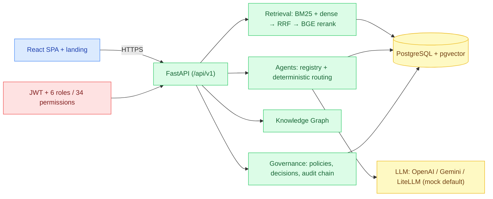
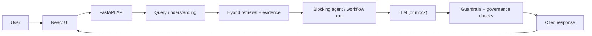

# RegIntel-AI

> AI-assisted regulatory intelligence: evidence-grounded research, compliance analysis, risk assessment, and governance workflows.

[](LICENSE)
[](requirements.txt)
[](requirements.txt)
[](frontend/package.json)
[](frontend/package.json)
[](render.yaml)
[](docker-compose.yml)
[](https://github.com/VIVEK-MARRI/RegIntel-AI/actions/workflows/ci.yml)

[](https://regintel-ai-748n.onrender.com/)

> Hosted on Render's free tier: the first load can take ~50 seconds while the
> service wakes up. Sign in to explore the dashboard, Copilot, research
> reports, and audit trail against the seeded demo data.

## Overview

Regulatory teams need to find relevant provisions, understand their implications, assess compliance risk, trace decisions, and keep an auditable trail. RegIntel-AI brings these into one system: a FastAPI backend with hybrid retrieval, deterministic agent coordination, governance workflows, and hash-chained audit — fronted by a React workspace covering research, compliance, audit, agents, and administration.

The free-tier deployment runs honestly within its limits: TF-IDF retrieval with RRF fusion ordering, mock LLM unless a key is provided, and ephemeral local state with durable Postgres underneath.

## Key Capabilities

| Capability | Description |
|---|---|
| Evidence-grounded Copilot | Regulatory Q&A with citations, confidence scoring, and hallucination guardrails |
| Hybrid Retrieval | BM25 + dense pgvector search fused by RRF, reranked by a BGE cross-encoder |
| Research | Synchronous structured reports with deep links and step traces |
| Compliance | Risk assessments with documented score bands, forecasts, policies, decisions |
| Knowledge Graph | Entity relationships, reachability, and dependency analysis |
| Agent Runtime | Registry, deterministic capability routing, blocking workflow runs |
| Audit | Hash-chain integrity checks, associated evidence, compliance reports |
| Analytics | Current-state agent operations (no invented trends) |
| Administration | Users, roles, permissions, and typed platform settings |

## Architecture


```mermaid
flowchart LR
    classDef edge fill:#dbeafe,stroke:#3b82f6,color:#1e40af
    classDef app fill:#dcfce7,stroke:#22c55e,color:#166534
    classDef data fill:#fef9c3,stroke:#eab308,color:#713f12
    classDef sec fill:#fee2e2,stroke:#ef4444,color:#7f1d1d

    Browser["React SPA + landing"]:::edge
    API["FastAPI (/api/v1)"]:::app
    Retrieval["Retrieval: BM25 + dense → RRF → BGE rerank"]:::app
    Agents["Agents: registry + deterministic routing"]:::app
    KG["Knowledge Graph"]:::app
    Gov["Governance: policies, decisions, audit chain"]:::app
    PG[("PostgreSQL + pgvector")]:::data
    LLM["LLM: OpenAI / Gemini / LiteLLM (mock default)"]:::data
    Auth["JWT + 6 roles / 34 permissions"]:::sec

    Browser -->|HTTPS| API
    Auth --> API
    API --> Retrieval
    API --> Agents
    API --> KG
    API --> Gov
    Retrieval --> PG
    Agents --> LLM
    Agents --> PG
    Gov --> PG
```

## Request Flow


```mermaid
flowchart LR
    User["User"] --> UI["React UI"]
    UI --> API["FastAPI API"]
    API --> Understand["Query understanding"]
    Understand --> Retrieve["Hybrid retrieval + evidence"]
    Retrieve --> Run["Blocking agent / workflow run"]
    Run --> LLM["LLM (or mock)"]
    LLM --> Verify["Guardrails + governance checks"]
    Verify --> Grounded["Cited response"]
    Grounded --> UI
```

Agent and workflow runs are synchronous throughout: no streaming UX, no task queues, no polling. The coordinator maps keywords to capabilities with fixed rules.

## Tech Stack

| Layer | Technologies |
|---|---|
| Frontend | React 18, TypeScript, Vite, Tailwind, TanStack Query, Vitest + MSW |
| Backend | Python 3.11, FastAPI, Pydantic v2, SQLAlchemy 2, Alembic |
| AI / Retrieval | sentence-transformers (BGE), BGE cross-encoder, TF-IDF fallback, httpx |
| Data | PostgreSQL + pgvector (HNSW), Neon-hosted on Render |
| LLM | OpenAI, Google GenAI, LiteLLM (all optional; mock by default) |
| Infrastructure | Docker, Nginx (self-host), Render Blueprint, pytest + Ruff + mypy in CI |

## Product Areas

| Area | Purpose |
|---|---|
| Dashboard | System overview |
| Copilot | Evidence-grounded Q&A |
| Documents | Ingestion and indexing |
| Knowledge Graph | Relationship and dependency exploration |
| Research | Structured research reports |
| Compliance | Assessments, forecasts, policies, decisions |
| Audit | Traceability, integrity, evidence, reports |
| Analytics | Agent operational analytics |
| Agents | Registry, coordination, workflows, messages |
| Admin | Users, roles, permissions, platform settings |
| Settings | Personal and browser-local preferences |

## Engineering Highlights

* Single typed API client with contract tests against backend schemas
* Authenticated session state machine; access tokens kept in memory
* Fail-closed behavior: unknown integrity is never "healthy"
* Canonical React Query keys with narrow, documented invalidation
* Blocking execution model — the UI never implies streaming or background work
* Scores render with documented 0–1 semantics, never as invented percentages

## Quality

* 2,892 backend tests collected; **419/419 frontend tests passing** (verified consecutive runs)
* API contract tests, TypeScript, ESLint, and production build all green
* Responsive verification at 390/768/1024/1440 per surface

## Run Locally

```bash
git clone https://github.com/VIVEK-MARRI/RegIntel-AI.git
cd RegIntel-AI

# Backend (needs PostgreSQL; see .env.example)
pip install -r requirements.txt
alembic upgrade head
uvicorn app.main:app --reload

# Frontend
cd frontend
npm ci
npm run dev
```

Copy `.env.example` to `.env` first. Without an LLM key the backend boots in clearly-labelled demo mode.

## Deployment

**Live application:** [https://regintel-ai-748n.onrender.com/](https://regintel-ai-748n.onrender.com/)

$0 Render Blueprint (`render.yaml`): static frontend + Python API + free Neon Postgres. Docker Compose with Nginx is provided for self-hosting. Cold starts and ephemeral local state apply on the free tier.

## Documentation

* `docs/FRONTEND_ARCHITECTURE_FINAL.md` — frontend architecture reference
* `docs/FINAL_FRONTEND_QA_STAGE17.md` — release-readiness review
* `docs/architecture/01-system-architecture.md` — system design
* Stage `docs/*_STAGE*.md` — per-surface engineering notes

## License

See [LICENSE](LICENSE) (MIT).

Built by [Vivek Marri](https://github.com/VIVEK-MARRI).
