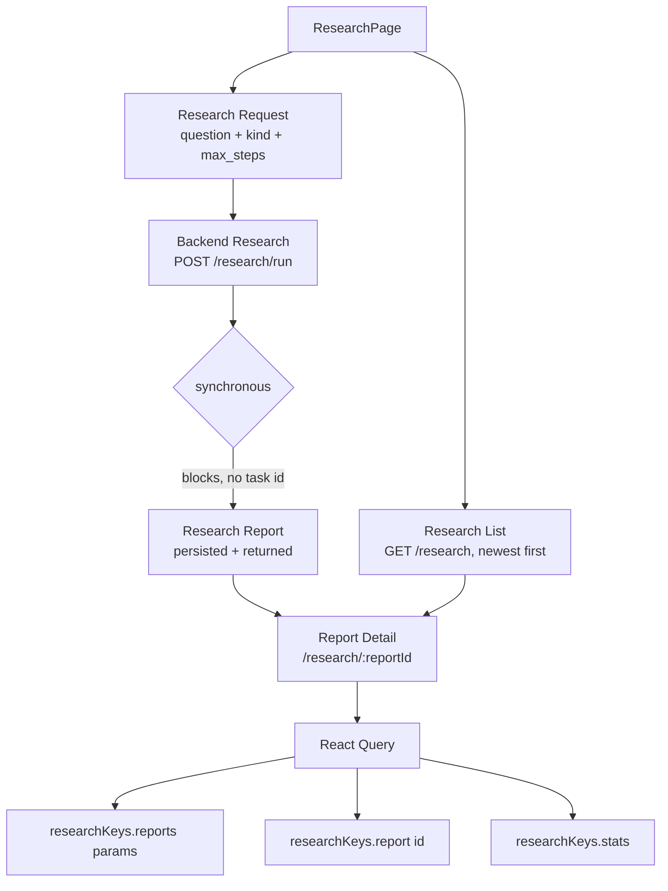

# Research Architecture - STAGE 10

## 1. Product purpose
A research workspace for structured regulatory investigation: ask a question with a
kind and step budget, wait for the synchronous run to produce a persisted report,
browse history newest-first, and open any report through a shareable deep link.
Deliberately NOT a chat interface: no bubbles, no streaming language, no fake
progress, no confidence badges.

## 2. Actual research workflow
Backend (`app/services/research/__init__.py`): `ResearchPlanner.plan` turns the
request into ordered steps (kind-specific templates) → `ResearchExecutor.execute`
runs retrieval over the knowledge provider (seeded per-request with hybrid-search
top-5 in the route) → `ResearchReportGenerator.generate` composes summary,
key findings, kind-specific sections, and citations → `InMemoryResearchStore`
persists (plus optional JSONL) → the complete report returns. One HTTP request,
start to finish. The sidebar copy says exactly this and nothing more.

## 3. Endpoint inventory
Backend: `app/api/v1/research.py` + `app/schemas/research.py` (`extra="forbid"`).
All routes verified in code; run/list shapes also verified by
`src/test/api-contracts.test.tsx`.

| Method | Path | Frontend use | Notes |
|---|---|---|---|
| GET | `/research/health` | NOT USED | Liveness only; no UI surface |
| GET | `/research/stats` | Overview metrics (NEW) | `ResearchStats`: totals, step counts, `by_kind`, `last_report_at` epoch|null |
| POST | `/research/run` | New research (mutation) | `ResearchRequest`; BLOCKS until done (`LONG_TIMEOUT_MS`); returns the full report |
| POST | `/research/plan` | NOT USED | Plan-without-execution; no UI in this stage (deferred, §22) |
| GET | `/research` | History list | `kind/after/before/page/page_size`; paged envelope (service unwraps to array); sorted `generated_at` desc server-side |
| GET | `/research/{report_id}` | Report detail | Full report; unknown id → 404 |

## 4. Request model
`ResearchRequest`: `query` (3–1000 chars, enforced 422 server-side), `kind`
(default `general`), `context` (supported but NOT exposed — no document/topic
picker exists to fill it meaningfully), `max_steps` (1–20, default 8). The form
exposes exactly question + kind + max steps. Run is disabled under 3 chars and
while a run is pending (duplicate prevention — reruns are expensive).

## 5. Execution model
C (persistent report workflow) with a SYNCHRONOUS run: no job queue, no task
ids, no status endpoint, no streaming. The pending UI is a blocking `role=status`
panel ("Research is running…") with honest copy and NO percentage, NO progress
bar, NO "live" language.

## 6. Status model
Reports have NO status field — they are completed persistent artifacts. Status
exists ONLY per step: `pending | running | completed | failed | skipped`, each
rendered as text + tone badge (never color-only). Unknown step statuses fall
through to neutral/"unknown" instead of crashing.

## 7. Report model
`ResearchReport`: `report_id, plan_id, query, kind, summary, key_findings`
(STRINGS, max 20), `timeline[]`, `comparisons[]`, `citations[]`, `steps[]`,
`generated_at` (epoch float), `duration_ms`, `metadata` (`step_count`,
`citation_count` — redundant with rendered counts, not displayed).

## 8. Steps model
`ResearchStep`: `step_id, step_type` (plan|retrieve|compare|reason|summarize),
`description`, `status`, `inputs/outputs` (dicts — NOT rendered; no key is
assumed), `error` (shown only when status is failed and non-empty),
`started_at/finished_at` (not displayed; durations derived), `duration_ms`
(shown as "took 4.2s"/"380ms" only when > 0).

## 9. Findings model
`key_findings` are PLAIN STRINGS (backend builds "Referenced: {title}" lines, or
the literal "No citations found in this run." when empty). Rendered verbatim as
a list. No citation attachment, no confidence, no restructuring.

## 10. Sources/evidence model
`ResearchCitation`: `citation_id, source` (monitoring|ingestion|
change_detection|impact_analysis|knowledge_graph|search|copilot), `title`,
`reference`, `url?`, `score`, `metadata`. Rendered: source badge (neutral —
order is backend order, never re-sorted), title, reference, and an "Open
reference" link ONLY when `url` is present. `score` is deliberately NOT shown
(to avoid implying a ranking semantic the backend does not define for this
surface). Empty citations get an explicit empty state, never implied sources.

## 11. Confidence/review behavior
No confidence field exists anywhere in the research contract (the Stage-02
contract test asserts its absence). The UI contains zero confidence UI: no
percentages, no badges, no "high confidence", no reliability language. The old
page's "confidence" workflow copy was removed.

## 12. Deep-link behavior
`/research/:reportId` (App.tsx, pre-existing) now actually reads the parameter:
detail is fetched ONLY by that id (`researchKeys.report(reportId)`); with no id
the list renders; with an unknown id a 404 produces "Report unavailable" with
retry + back — never another report (there is NO local selected-report state to
fall back to). Refresh preserves the report; "← All reports" returns to
`/research`. "Run again with this question" fills the form (explicit user action
required to spend another run) and focuses it.

## 13. Query/cache architecture
- `researchKeys.stats()` — overview (no params).
- `researchKeys.reports({kind?, page?, page_size?})` — history; extended from the
  paramless Stage-02 shape. Dashboard's no-arg `reports()` call still typechecks
  and works (params optional).
- `researchKeys.report(id)` — detail, seeded from the run response.
Local state holds ONLY form values, list filter/page, and presentation. No
polling exists (nothing to poll). No report data is duplicated into useState.

## 14. Invalidation matrix
- Run success → `setQueryData(report(id), response)` + invalidate the
  `["research","reports"]` prefix (covers all filter/page variants) + navigate
  to the real id. Dashboard's own `reports()` invalidation is untouched and
  still prefix-compatible.
- No detail invalidation on run (seeded data is authoritative; background
  refetch reconciles).
- No cross-domain invalidation (dashboard research rows share the same
  `reports()` key family and refresh through their own queries).

## 15. Loading/error/empty states
Independent per region (stats / form-run / list / detail), all Stage-05
primitives: Skeleton, ErrorState+Retry (ApiClientError message, never
`[object Object]`, no tokens), EmptyState with distinct copy for no-reports,
no-steps, no-findings, no-citations, report-not-found. 422 validation surfaces
the backend message. Lists use `aria-live="polite"`; errors use `role="alert"`.

## 16. Retry/cancellation
No backend retry or cancel endpoints exist, so neither is faked. Retry = the
mutation's ErrorState Retry button (explicit re-POST) and "Run again with this
question" (new report, new id, no silent duplicates). No abort button — a
client-side abort would not stop server work, and claiming otherwise would be
dishonest.

## 17. Responsive behavior
Single column stacks at all widths; the request grid (`1fr/180px/140px/auto` on
`lg`) collapses to stacked fields on mobile; report meta wraps; long queries and
references truncate with `title` fallbacks. Verified 390/768/1024/1440 with zero
horizontal overflow (screenshots `landing/_review/ds10-research-*` and
`ds10-report-*`; gitignored local artifacts like prior stages).

## 18. Accessibility
One h1 ("Research"); report question is h2 with section h3s (Summary, Steps,
Key findings, Timeline, Comparisons, Sources & citations); labelled inputs with
hint/error wiring from `Field`; keyboard-operable Run and list buttons;
`role=status` for the run (not announced per-keystroke — a single static region);
`role=alert` on errors; `article` landmark for the report; neutral-badge source
labels (no color-only meaning); external links labelled with their target title.

## 19. Security
Question travels as POST body (React-escaped on render); model-generated text
renders as plain text — no `dangerouslySetInnerHTML`, no markdown pipeline;
citation URLs render as links with `rel="noreferrer"` (backend-provided, not
user input); ids path-encoded; page behind the existing `Protect` guard; no new
auth surface.

## 20. Performance
List pages at 20, detail fetches one report; no per-row detail prefetch; no
polling; long finding/citation/step lists get `max-h` + internal scroll in list
context and natural document flow in detail; no virtualization invented.

## 21. Backend limitations (honest)
- Run is synchronous and can take a minute+: the UI blocks honestly (120s client
  timeout) with no progress insight.
- Service unwraps the list envelope → no totals ("Page N · M shown", short-page
  Next heuristic).
- `after/before` filters and `context` scoping exist server-side but have no UI
  (no date picker / document picker to drive them correctly).
- `score`, step `inputs/outputs`, `metadata` are returned but not displayed (no
  defined UI semantics).
- Citation source `knowledge_graph` is a label only — no entity ids ship with
  reports, so no KG deep links are offered (§13 of the stage: only with a usable
  reference).
- Store is in-memory + optional JSONL: history durability depends on deployment.

## 22. Deferred features
Plan-only preview (`POST /research/plan`), `after/before` date filters,
`context` scoping UI, stats `by_kind` breakdown display, citation score display
(pending defined semantics), KG cross-links (pending entity references in
reports), report export/print stylesheet.

## 23. Verification
- `tsc --noEmit` clean; `eslint` clean; `vite build` clean
  (ResearchPage chunk ~21KB).
- Full suite: 18 files / 271 tests pass, including 26 new
  `src/test/research.test.tsx` tests (request validation/payload/no-duplicates,
  list/filter/pagination/empty/error, sync run → navigate → detail, failure +
  retry, run-again explicitness, deep-link exactness/unknown/back, all report
  sections, timeline/comparisons kinds, no-confidence, malformed safety, cache
  refresh, h1/keyboard/landmark semantics).
- Responsive screenshots: list + detail at 390/768/1024/1440.
