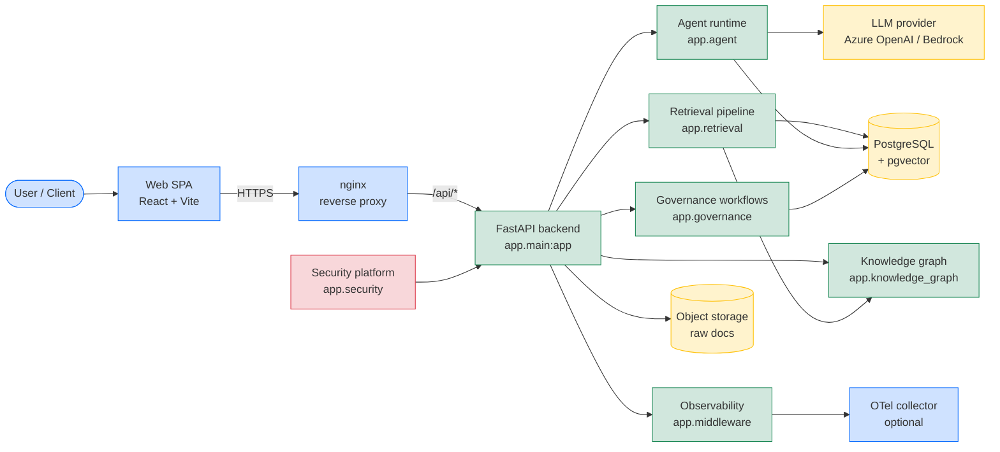
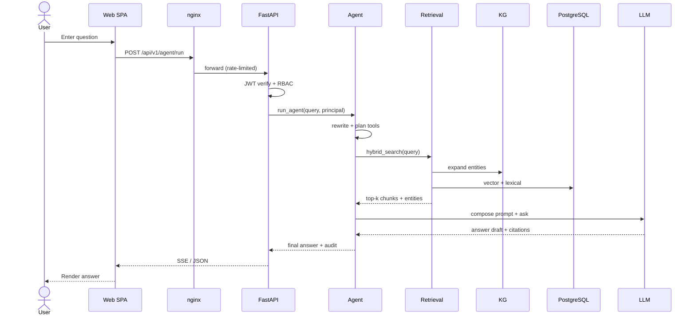
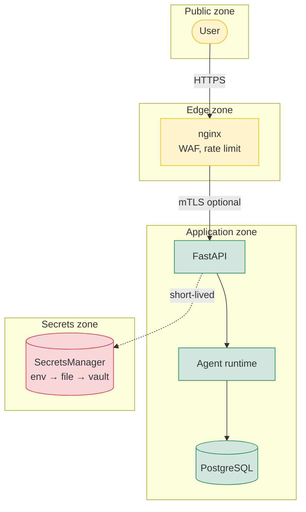

# 01 — System Architecture

## Overview

RegIntel AI is a retrieval-augmented regulatory intelligence platform. It
ingests regulatory documents, builds a hybrid knowledge graph + vector
index, and exposes a chat agent that answers questions with grounded
citations, governance workflows, and an auditable trail.

The system has three runtime layers:

1. **Edge** — nginx reverse proxy that terminates TLS, applies rate limits
   and security headers, and fronts the frontend SPA.
2. **Application** — a FastAPI backend that owns the API surface, the
   agent runtime, the retrieval pipeline, the knowledge graph, and the
   governance workflow engine.
3. **Data** — PostgreSQL (with the pgvector extension) for relational and
   vector storage; Redis (optional) for rate limiting and ephemeral state;
   the local filesystem for raw document blobs and audit JSONL archives.

## High-level diagram

## Component responsibilities

| Layer | Component | Responsibility | Source |
|-------|-----------|----------------|--------|
| Edge | `nginx` | TLS termination, gzip, security headers, rate limit | `nginx.conf` |
| Edge | Web SPA | Query / answer UI, admin console, observability dashboards | `frontend/` |
| App | `app.main` | Composition root, router registration, startup | `app/main.py` |
| App | `app.api.v1.*` | HTTP handlers (FastAPI routers) | `app/api/v1/` |
| App | `app.agent` | RAG agent, tools, planners, reasoning loop | `app/agent/` |
| App | `app.retrieval` | Hybrid retrieval, re-ranking, evaluation | `app/retrieval/` |
| App | `app.knowledge_graph` | Entity/relation extraction, graph traversal | `app/knowledge_graph/` |
| App | `app.governance` | Decision review, approval workflow, audit | `app/governance/` |
| App | `app.security` | JWT, RBAC, secrets, threat detection, audit review | `app/security/` |
| App | `app.benchmark` | Performance, load, latency, cost benchmark | `app/benchmark/` |
| App | `app.middleware` | Rate limit, audit log, request ID, request signing | `app/middleware/` |
| Data | PostgreSQL | Relational + vector storage (pgvector) | `alembic/` |
| Data | Object storage | Raw PDFs, audio, video; chunked text | `app/storage/` |
| Data | LLM provider | Embeddings, completions, rerank | `app/llm/` |
| Data | OTel collector | Metrics + trace export | optional |

## Request flow (chat query)

## Deployment topology

The `docker-compose.production.yml` stack runs two services:

* `backend` — single replica of the FastAPI app under gunicorn+uvicorn
  workers. Stateless — scale horizontally behind a load balancer.
* `frontend` — static SPA served by nginx. Replicas scale with traffic.

PostgreSQL and object storage are external (managed service). The stack
ships with a sidecar `otel-collector` for OTLP export (optional).

See [04 — Deployment Architecture](./04-deployment-architecture.md) for
the production wiring, network policies, and secret plumbing.

## Trust boundaries

Every cross-boundary call goes through authentication and authorisation
enforced by `app.security.api_gateway.APIGateway` and the JWT
middleware. See [02 — Agent Architecture](./02-agent-architecture.md)
for the inner workings of the agent and [09 — Operations
Guide](./09-operations-guide.md) for the security runbook.

## See also

* [Architecture index](./README.md)
* [01 — System Architecture](./01-system-architecture.md)
* [05 — Data Flow](./05-data-flow.md)
* [06 — Components](./06-components.md)
* [07 — API Reference](./07-api-reference.md)

