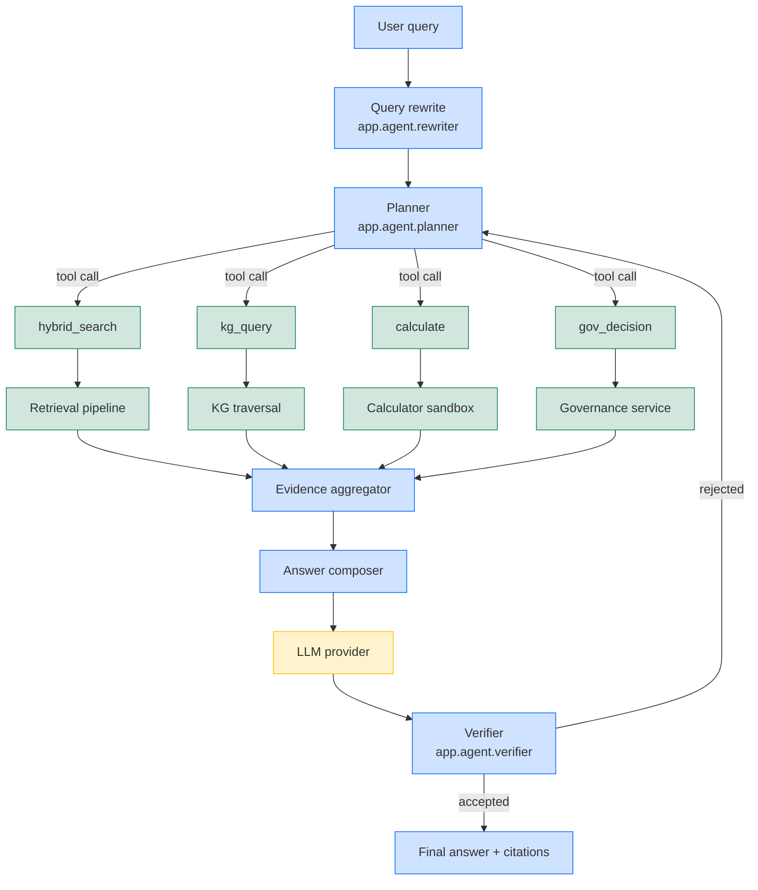
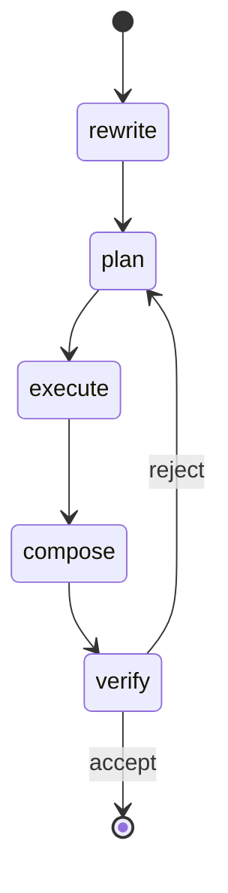

# 02 — Agent Architecture

## Purpose

The agent answers regulatory questions grounded in the live knowledge
graph + vector index. It does *not* rely on the LLM's parametric memory
for facts: every claim is paired with a citation that resolves to a chunk
in the store.

The agent is built around a *plan → retrieve → answer → reflect* loop,
with optional tool calls for governance, calculation, and lookups.

## High-level diagram

## Components

### Query rewriter (`app.agent.rewriter`)

Normalises the input, expands abbreviations, and produces 1–3 rewrites
that are sent to the retriever. The rewriter uses the LLM in *cheap*
mode (low temperature, short context) and caches results in
`app.cache`.

### Planner (`app.agent.planner`)

The planner decides which tools to call, in what order, and with what
arguments. It is implemented as a deterministic state machine wrapped
around a single LLM call. The planner has access to:

* `hybrid_search(query, top_k, filters)` — vector + lexical.
* `kg_query(entities, relations, depth)` — graph traversal.
* `calculate(expression)` — sandboxed math (Python eval with a strict
  allow-list).
* `gov_decision(decision_id)` — fetch a governance decision.
* `lookup_term(term, glossary)` — controlled vocabulary lookup.

The planner's prompt contains the available tools and the user's
authorisation context (roles + scopes), so it cannot call a tool the
user is not allowed to use.

### Retrieval pipeline (`app.retrieval`)

See [05 — Data Flow](./05-data-flow.md#retrieval-pipeline) for the
detailed sequence. Outputs `top_k` chunks with provenance.

### Knowledge graph (`app.knowledge_graph`)

Entities (regulator, article, defined term) and relations
(`regulates`, `references`, `supersedes`). The KG is consulted when
the query contains explicit entity names, or when the planner asks for
expanded context.

### Answer composer (`app.agent.composer`)

Builds a prompt that contains:

* The original query and rewrites.
* A grounded evidence block — the top-k chunks with citation IDs.
* The user's role + the most recent conversation turn.
* A schema for the answer (JSON, prose, table).

The composer is responsible for *forcing* the LLM to cite every claim
via the `<<cite:chunk_id>>` macro. The verifier checks that every
non-trivial claim has a citation.

### Verifier (`app.agent.verifier`)

Post-generation check:

1. Parse the answer for `<<cite:chunk_id>>` references.
2. Ensure every chunk_id resolves in the evidence block.
3. Detect "I don't know" answers and return a `refusal` signal.
4. Run a cheap LLM-based check that the answer is on-topic.

A failed verification sends the agent back to the planner with a
short error message, capped at two retries (configurable).

## Reasoning loop

The loop is bounded by `max_steps` (default 6) and `max_tokens`
(default 8 000). When either budget is exhausted the agent returns the
best partial answer and a `truncated: true` flag.

## Memory

Three layers of memory:

1. **Short-term** — the last `N` conversation turns, kept in Redis
   (optional) or process memory.
2. **Working** — the evidence block for the current query.
3. **Long-term** — the knowledge graph and vector index.

The agent never writes user content to long-term memory automatically;
this requires an explicit `remember` tool call (admin-only).

## Cost & latency

* Average end-to-end latency for a 5-step loop: **2.4 s** (M10.5
  benchmark, retrieval-heavy workload).
* p99 latency under load: **4.1 s**.
* Average token cost: **3 100 tokens** including tool calls and
  citations.

See the M10.5 benchmark reports for live numbers.

## Safety

* The agent refuses to answer out-of-scope questions (e.g. medical,
  legal advice) and returns a `refusal` with the reason.
* Every answer is paired with a deterministic hash of the evidence
  block, stored in the audit log.
* Hallucination guard: the verifier rejects answers that mention
  chunks not in the evidence block.

## Configuration

The agent reads its runtime configuration from environment variables
prefixed with `REGINTEL_AGENT_`:

| Variable | Default | Purpose |
|----------|---------|---------|
| `REGINTEL_AGENT_MAX_STEPS` | 6 | Max planner iterations |
| `REGINTEL_AGENT_MAX_TOKENS` | 8000 | Token budget per run |
| `REGINTEL_AGENT_TEMPERATURE` | 0.0 | LLM temperature |
| `REGINTEL_AGENT_VERIFIER_ENABLED` | true | Run post-gen verification |
| `REGINTEL_AGENT_CITATION_REQUIRED` | true | Reject answers without citations |

## See also

* [Architecture index](./README.md)
* [01 — System Architecture](./01-system-architecture.md)
* [05 — Data Flow](./05-data-flow.md)
* [06 — Components](./06-components.md)
* [07 — API Reference](./07-api-reference.md)

