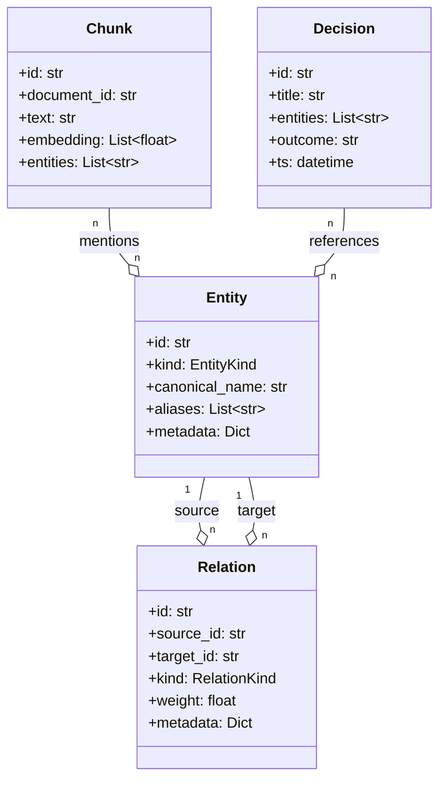
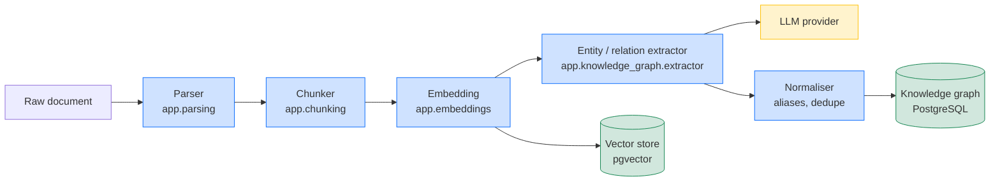

# 03 — Knowledge Graph Architecture

## Purpose

The Knowledge Graph (KG) is a curated, versioned graph of regulatory
entities and the relations between them. It powers:

* **Entity-aware retrieval** — when a query names an entity, we can
  follow the graph to find related articles, definitions, and
  decisions.
* **Disambiguation** — the graph knows that "FRB" is a regulator
  distinct from "FCA", and that "MiFID II" was superseded by
  "MiFIR".
* **Decision support** — governance workflows can ask the graph
  "what regulations apply to a swap traded by a US bank on EU
  clients?" and get a deterministic answer.

## Data model



### Entity kinds

| Kind | Examples |
|------|----------|
| `REGULATOR` | FCA, SEC, ESMA, FRB |
| `INSTRUMENT` | MiFID II, Dodd-Frank, GDPR |
| `ARTICLE` | "Article 5(2) of MiFID II" |
| `DEFINED_TERM` | "regulated market", "eligible counterparty" |
| `JURISDICTION` | EU, US, UK |
| `DATE` | "2024-01-01" |
| `ORG` | non-regulator organisations (issuers, dealers) |
| `PERSON` | named individuals (rare) |

### Relation kinds

| Kind | Source → Target |
|------|-----------------|
| `REGULATES` | regulator → instrument |
| `SUPERSEDES` | instrument → instrument |
| `REFERENCES` | article → entity |
| `DEFINES` | instrument → defined_term |
| `APPLIES_TO` | instrument → jurisdiction |
| `OWNS` | organisation → person |
| `DECIDED` | regulator → decision |

## Storage

The KG is stored in PostgreSQL with three tables:

* `kg_entities` — one row per entity, GIN index on `aliases` for fuzzy
  lookup.
* `kg_relations` — one row per relation, composite index on
  `(source_id, kind)` and `(target_id, kind)`.
* `kg_chunks` — chunk-to-entity mapping, with the chunk text + vector
  embedding (pgvector).

The raw graph is exposed to the agent as a virtual table; the retriever
joins chunks → entities → relations on demand.

## Ingestion



The extractor uses an LLM in a structured-output mode to identify
entities + relations, then runs the normaliser to:

* Merge aliases to canonical names.
* Deduplicate entities (Jaro-Winkler ≥ 0.92 or exact ID match).
* Reject low-confidence extractions (score < 0.5).
* Attach provenance (source chunk, document, page).

The extraction is **idempotent**: re-running on the same document is
a no-op.

## Query patterns

### 1. Entity lookup

```
GET /api/v1/kg/entities/{id}
```

Returns the entity, its aliases, and a 1-hop neighbourhood.

### 2. Hybrid retrieval (chunk + entity)

```
POST /api/v1/retrieval/search
{
  "query": "What does MiFID II say about best execution?",
  "top_k": 10,
  "expand_graph": true
}
```

The retriever:

1. Embeds the query.
2. Performs a vector search → top `top_k` chunks.
3. Extracts entities from the query and the top chunks.
4. Expands each entity by 1-hop in the KG.
5. Adds the relations + connected entities to the evidence block.

### 3. Graph query (programmatic)

```python
from app.knowledge_graph import KGQuery

kg = KGQuery()
neighbours = kg.neighbours("MiFID II", depth=2, kinds=("SUPERSEDES", "REFERENCES"))
```

## Versioning

The graph is versioned by ingestion run. Each ingestion produces a
`kg_version` row with:

* `id` — ULID.
* `started_at`, `finished_at`.
* `documents_processed`, `entities_added`, `relations_added`.
* `extractor_version`, `embedding_model_version`.

A query can pin to a specific version (read-only snapshot), or use the
default `latest` alias. Rollback is supported by switching the
default alias back to a previous version.

## Performance

* Entity lookup (id → 1-hop): **0.4 ms** p50, **2.1 ms** p99.
* Hybrid retrieval (vector + 1-hop expand): **42 ms** p50, **118 ms** p99.
* Graph traversal (depth 3, filtered): **18 ms** p50, **74 ms** p99.

These are measured on a 1M-chunk, 250K-entity, 1.5M-relation dataset
on a `db.r6g.large` RDS instance. See M10.5 benchmark reports.

## Operations

* **Re-extraction** — a background job runs nightly to re-extract
  entities from documents whose content has changed.
* **Drift detection** — a daily job compares the canonical name set
  against the previous version and alerts on new aliases.
* **GC** — orphaned entities (no relations, no chunk mentions) are
  archived after 90 days.

## Configuration

| Variable | Default | Purpose |
|----------|---------|---------|
| `REGINTEL_KG_EXTRACTOR_MODEL` | `gpt-4o-mini` | LLM for extraction |
| `REGINTEL_KG_MIN_CONFIDENCE` | 0.5 | Drop extractions below this |
| `REGINTEL_KG_DEFAULT_DEPTH` | 1 | Default graph expansion depth |
| `REGINTEL_KG_VERSION` | `latest` | Default version alias |


## See also

* [Architecture index](./README.md)
* [01 — System Architecture](./01-system-architecture.md)
* [05 — Data Flow](./05-data-flow.md)
* [06 — Components](./06-components.md)
* [07 — API Reference](./07-api-reference.md)

