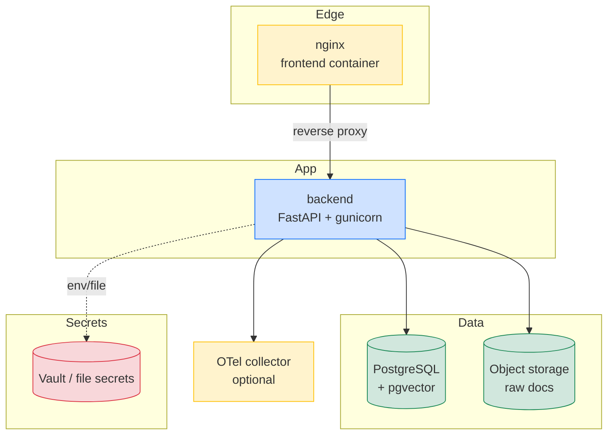
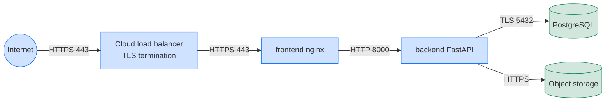

# 04 — Deployment Architecture

## Container topology



## Container images

### `backend`

Multi-stage Dockerfile, `Dockerfile.production`:

* **Builder** — `python:3.11-slim` with build tools.
* **Runtime** — `python:3.11-slim` with only the runtime libs and the
  prebuilt wheelhouse. Image size: **~480 MB**.
* **User** — non-root `appuser` (UID 10001).
* **Init** — `tini` as PID 1.
* **Healthcheck** — `GET /health/live` (200 = live, 400+ = not live).
* **Env** — workers, log level, secret paths come from environment.

### `frontend`

Multi-stage Dockerfile, `frontend/Dockerfile.production`:

* **Builder** — `node:20-alpine` to build the SPA.
* **Runtime** — `nginx:1.27-alpine` serving the built static assets
  with the bundled `nginx.conf`.
* **User** — unprivileged nginx user.
* **Caching** — assets under `/assets/` are served with
  `Cache-Control: public, max-age=31536000, immutable`.

## docker-compose

`docker-compose.production.yml` defines two services:

```yaml
services:
  backend:
    image: ghcr.io/regintel/regintel-ai/backend:v1.0.0
    user: "10001:10001"
    read_only: true
    tmpfs: [/tmp]
    security_opt:
      - no-new-privileges:true
    cap_drop: [ALL]
    cap_add: [NET_BIND_SERVICE]
    healthcheck:
      test: ["CMD", "python", "-c", "import httpx, sys; sys.exit(0 if httpx.get('http://localhost:8000/health/live').status_code == 200 else 1)"]
      interval: 10s
      timeout: 3s
      retries: 3
      start_period: 30s
    depends_on:
      postgres: { condition: service_healthy }
    environment:
      REGINTEL_DB_URL: postgresql+asyncpg://...
      REGINTEL_JWT_SECRET: ${REGINTEL_JWT_SECRET:?must be set}
      REGINTEL_LLM_PROVIDER: ${REGINTEL_LLM_PROVIDER}
      REGINTEL_LOG_LEVEL: info
    deploy:
      resources:
        limits: { cpus: "2.0", memory: 2G }
        reservations: { cpus: "0.5", memory: 512M }
    restart: unless-stopped

  frontend:
    image: ghcr.io/regintel/regintel-ai/frontend:v1.0.0
    ports: ["443:443"]
    depends_on:
      backend: { condition: service_healthy }
    security_opt:
      - no-new-privileges:true
    cap_drop: [ALL]
    cap_add: [NET_BIND_SERVICE, CHOWN, SETUID, SETGID]
    read_only: true
    tmpfs: [/var/cache/nginx, /var/run]
    restart: unless-stopped
```

## Network model



All internal traffic stays on the `appnet` bridge network. Only the
frontend container exposes port 443; the backend is reachable only via
the frontend.

## Security

### Image

* Multi-stage builds; no build tools in the runtime image.
* Non-root user.
* `no-new-privileges:true`, `cap_drop: ALL`, `cap_add: NET_BIND_SERVICE`.
* Read-only root filesystem with explicit `tmpfs` mounts.
* Vulnerability scanning in CI (Trivy, SARIF to GitHub Security tab).

### Runtime

* `REGINTEL_JWT_SECRET` must be ≥ 32 characters, sourced from a secret
  manager (Vault, AWS Secrets Manager, file mount). The image refuses
  to start with a development secret in production.
* `REGINTEL_CORS_ORIGINS` is strict-by-default; wildcards are rejected
  when credentials are enabled.
* `REGINTEL_SECURITY_DEV_TOKEN_ENDPOINT` must be unset (or `false`) in
  production.
* Rate limit (nginx): 100 rps per IP for `/api/*`, 10 rps per IP for
  `/api/v1/security/auth/token`.

### Network

* The backend never exposes a public port.
* Outbound traffic is restricted by `internal` network in compose and
  by VPC firewall rules in production.
* Object storage access uses an IAM role, not a long-lived key.

## Secrets

Secrets are resolved in order: `env → file → vault`. The container
mounts:

* `/run/secrets/jwt_secret` — JWT signing secret (file, mode 0400).
* `/run/secrets/db_password` — database password.
* `REGINTEL_VAULT_URL` and `REGINTEL_VAULT_TOKEN` — for additional
  secrets (e.g. LLM provider keys) that live in Vault.

See [app.security.secrets](../README.md#security-platform-m106) for the
full resolution semantics.

## Observability

* **Metrics** — Prometheus endpoint at `/metrics` (text format). Key
  metrics:
  * `regintel_http_requests_total{route, status}`
  * `regintel_http_request_duration_seconds_bucket{...}`
  * `regintel_agent_run_duration_seconds{outcome}`
  * `regintel_retrieval_duration_seconds{stage}`
  * `regintel_security_threats_total{type, level}`
  * `regintel_benchmark_run_duration_seconds{suite}`

* **Logs** — structured JSON to stdout (one object per line). Shipped
  to the platform of choice (Loki, CloudWatch, Datadog) by the host.
  Required fields: `ts`, `level`, `msg`, `request_id`, `route`,
  `status`, `duration_ms`.

* **Traces** — OpenTelemetry; OTLP exporter configurable via
  `REGINTEL_OTEL_EXPORTER_OTLP_ENDPOINT`. Sampling rate
  `REGINTEL_OTEL_SAMPLING_RATIO` (default 0.1).

* **Health** — `/health/live` (process up) and `/health/ready`
  (dependencies reachable).

## Scaling

* **Stateless backend** — scale horizontally. gunicorn workers default
  to `(2 × CPU) + 1`.
* **PostgreSQL** — read replicas for retrieval-only workloads; primary
  for writes (ingestion, governance).
* **Object storage** — provider-managed.
* **Frontend** — CDN-fronted in production (CloudFront / Cloudflare).

## Disaster recovery

* **RPO** — 1 hour (hourly base backup + WAL archiving).
* **RTO** — 30 minutes (warm standby in a different AZ).
* **Object storage** — versioning enabled, 30-day retention.

## Release channels

| Channel | Tag | Audience |
|---------|-----|----------|
| Stable | `vX.Y.Z` | Production |
| RC | `vX.Y.Z-rcN` | Staging, internal users |
| Nightly | `nightly` | Developers, canary |

The CI pipeline (`.github/workflows/release.yml`) builds multi-arch
images (`linux/amd64`, `linux/arm64`) on tag push and publishes them
to GHCR with SBOM and provenance attestations.


## See also

* [Architecture index](./README.md)
* [01 — System Architecture](./01-system-architecture.md)
* [05 — Data Flow](./05-data-flow.md)
* [06 — Components](./06-components.md)
* [07 — API Reference](./07-api-reference.md)

