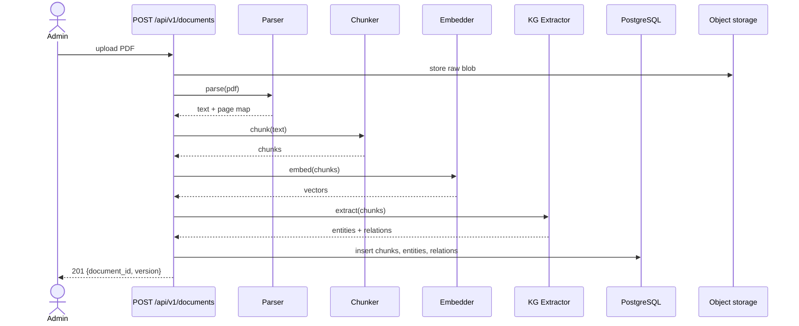
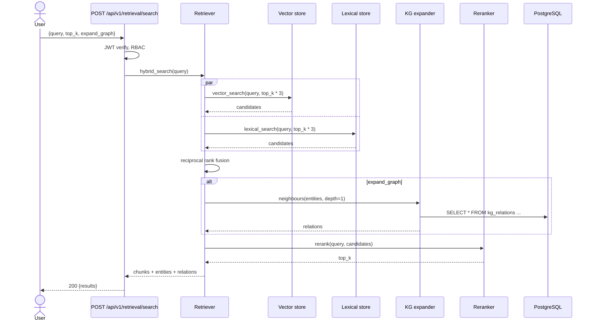
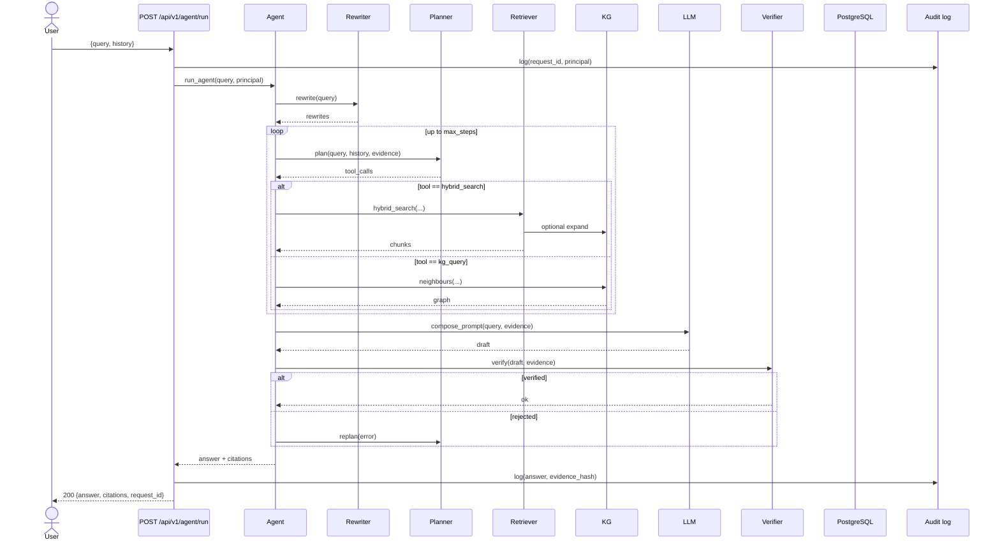
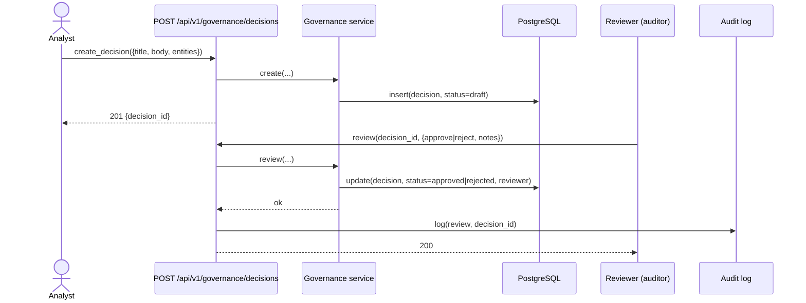
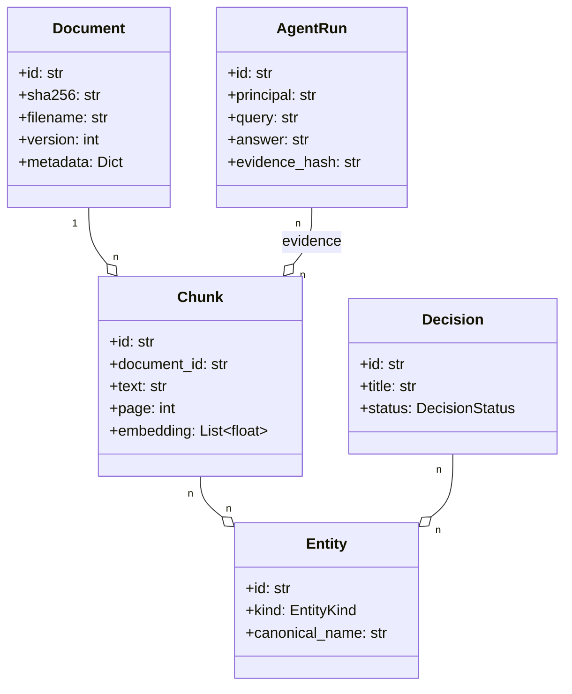

# 05 — Data Flow

This document describes the runtime data flow for the three primary
operations: **ingest**, **search**, and **agent run**. Sequence diagrams
use the standard Mermaid notation.

## 1. Ingest pipeline

### Notes

* Ingestion is idempotent — re-uploading the same SHA-256 is a no-op.
* The KG extractor is async; the API returns immediately and the
  extraction runs in a background task.
* The chunker is configured by `REGINTEL_CHUNK_SIZE` (default 800
  tokens) and `REGINTEL_CHUNK_OVERLAP` (default 100 tokens).

## 2. Search (hybrid retrieval)

### Notes

* Vector search uses pgvector with HNSW index.
* Lexical search uses `tsvector` (Postgres full-text) with a
  trigram index for fuzzy term matching.
* The reranker is a cross-encoder model (configurable). When the
  reranker is disabled (`REGINTEL_RETRIEVAL_RERANKER=false`),
  RRF output is returned directly.
* Each result carries a `provenance` block: `chunk_id`, `document_id`,
  `version`, `page`, `score`, `kg_relations`.

## 3. Agent run

### Notes

* The agent loop is bounded by `max_steps` (default 6) and
  `max_tokens` (default 8 000).
* The verifier rejects answers that lack citations or that mention
  chunks not in the evidence block.
* The audit log entry contains the principal, the evidence block
  hash, the final answer, and the token cost.

## 4. Governance decision

### Notes

* Decisions flow through: `draft → in_review → approved | rejected`.
* The auditor role is required to call `review`.
* All transitions are immutable — the history is preserved.

## Class diagram (core domain)

## See also

* [Architecture index](./README.md)
* [01 — System Architecture](./01-system-architecture.md)
* [02 — Agent Architecture](./02-agent-architecture.md)
* [03 — Knowledge Graph](./03-knowledge-graph.md)
* [06 — Components](./06-components.md)
